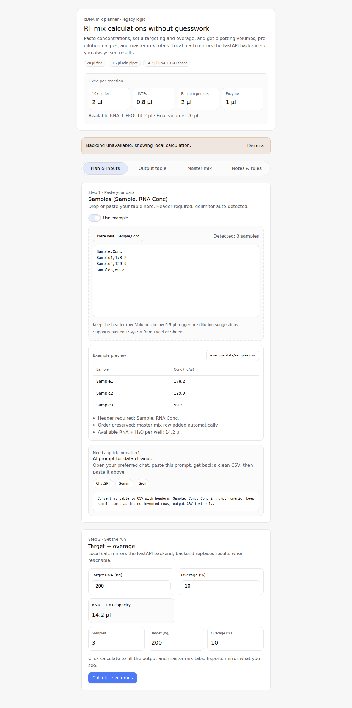
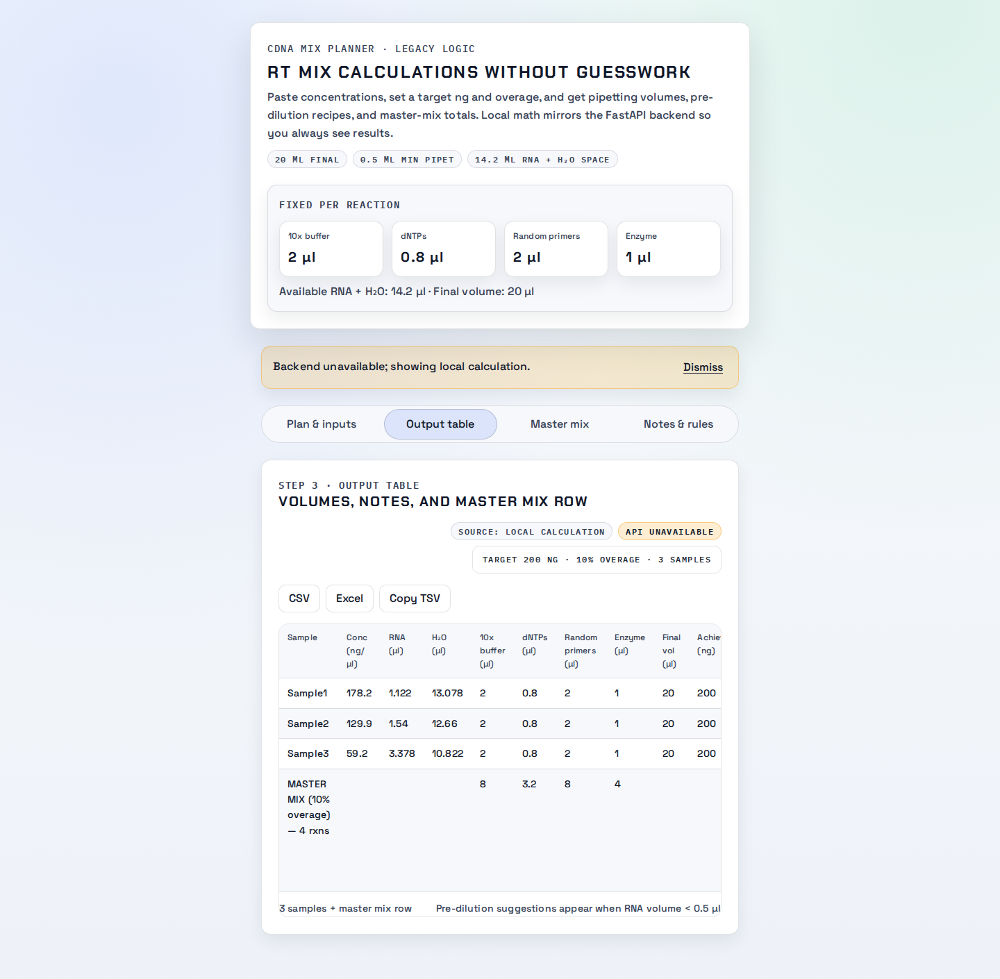
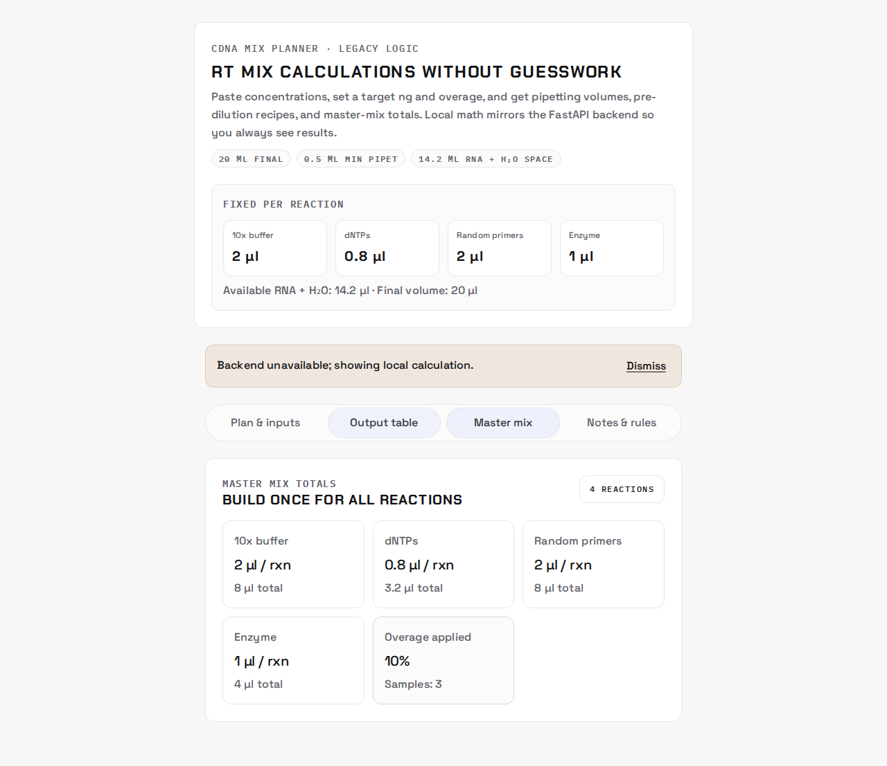
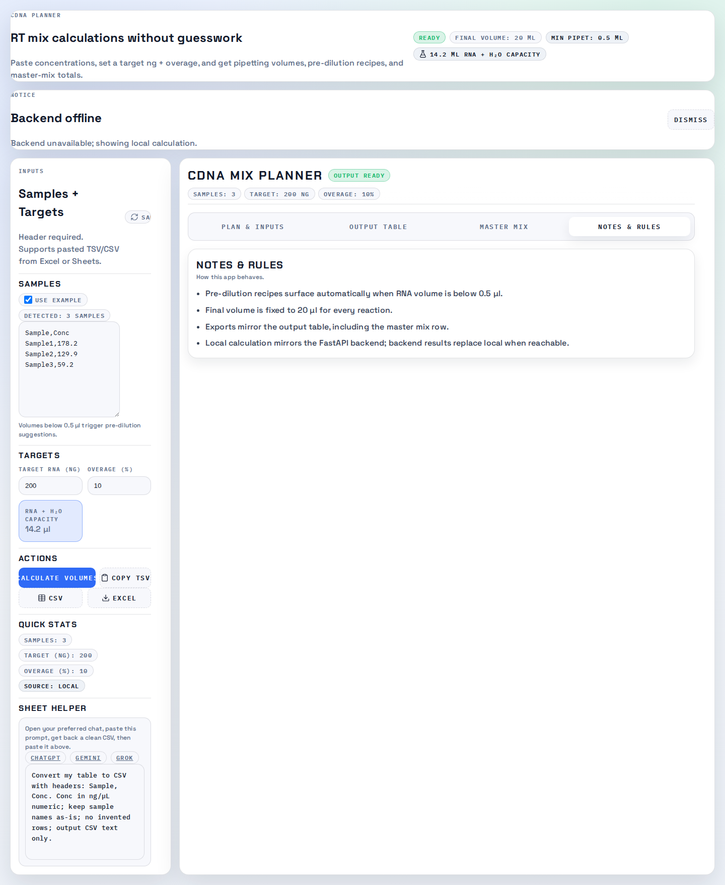

# cDNA Calculations App (React + FastAPI)

Modern React + FastAPI app with lab notebook neo-brutalist styling. Paste sample concentrations, set a target ng, and get per-sample RNA/H₂O volumes, pre-dilution guidance when pipet volumes are too small, and master-mix totals. CSV/Excel export and clipboard copy are built in. Playwright E2E drives the bundled example and regenerates the screenshot. Legacy notes (if any) are in `LEGACY.md`.

Part of **Easylab Suite**: when bundled, it launches from the suite desktop launcher as the **cDNA Calculator** module.

License: All Rights Reserved.

Latest UI (refreshed Dec 28, 2025 via `npm run test:e2e`):

| Plan | Output | Master mix | Notes |
| --- | --- | --- | --- |
|  |  |  |  |

## Highlights
- Input: tab/comma/space-separated `Sample,Conc` with header.
- Logic parity with legacy: fixed reagents (10x buffer, dNTPs, random primers, enzyme), 20 µl final, 10% overage default, pre-dilution suggestions below 0.5 µl RNA, master mix summary row.
- Outputs: interactive table, CSV export, Excel export, clipboard TSV.
- Example data: `example_data/samples.csv`.

## Setup (D:)
```bash
cd "<PROJECTS_DIR>/cDNA-calculations-app/modern-app"
# Reuse deps by copying node_modules/.venv from another modern app if desired
npm install           # if node_modules missing
python3 -m venv .venv
./.venv/bin/pip install --break-system-packages -r backend/requirements.txt
```

## Run (dev)
```bash
npm run dev:full   # front :5176, API :8003
```
Open http://localhost:5176, toggle **Use Example Data**, and click **Calculate Volumes**.

## Desktop Installer (Windows)
From the repo root (next to this README):

```bash
npm install
npm run build:electron
```

The installer is generated in `desktop/dist/` as an `.exe` (NSIS). On first run, the app asks for storage folders and creates them for you.

Notes:
- The packaged app expects Python 3.10+ available on PATH to run the FastAPI backend. You can set `APP_PYTHON_PATH` to a specific Python executable if needed.
- The installer is unsigned unless code-signing credentials are configured.

## Tests & screenshot
```bash
npx playwright install --with-deps chromium   # once, if not already installed
npm run test:e2e
```
The E2E starts both servers, runs the example flow, and writes `screenshots/example_run.png`.

## API
- `POST /calculate` → rows + master_mix (body: samples[], target_ng, overage_pct, use_example?)
- `POST /export-excel` → Excel workbook with the grid
- `GET /example`, `GET /health`

All endpoints honor `use_example: true` to run without user data.
